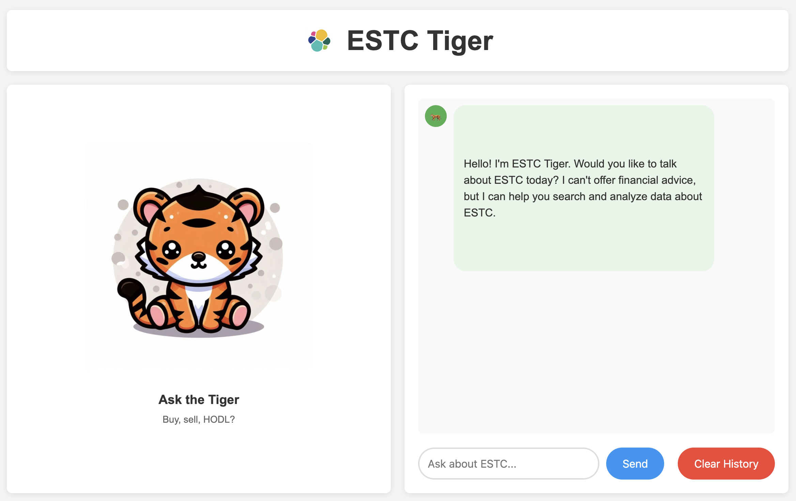

# ESTC Tiger 🐅

ESTC Tiger is an intelligent chatbot designed to help Elastic (ESTC) RSU holders make informed investment decisions. The app combines AI-powered analysis with comprehensive financial data to provide actionable insights about ESTC stock performance, market trends, and RSU timing strategies.



## Installation & Setup

### Prerequisites

- Python 3.12 or higher
- UV package manager
- Anthropic API key (required)
- Elasticsearch cluster (required - app will not function without it)
- Finnhub API key (optional - for real-time stock data, falls back to historical estimates)

### 1. Clone the Repository

```bash
git clone https://github.com/stuartMoorhouse/estc-tiger.git
cd estc-tiger
```

### 2. Install Dependencies

```bash
uv sync
```

### 3. Environment Configuration

Create a `.env` file in the project root:

```bash
# Required: Anthropic API key
ANTHROPIC_API_KEY=your_anthropic_api_key_here

# Optional: Finnhub API key for real-time stock data
FINNHUB_API_KEY=your_finnhub_api_key_here

# Optional: Elasticsearch configuration
ELASTICSEARCH_URL=http://localhost:9200
ELASTICSEARCH_USERNAME=elastic
ELASTICSEARCH_PASSWORD=your_password
# OR use API key authentication:
# ELASTICSEARCH_API_KEY=your_api_key_here
```

#### Getting API Keys:

- **Anthropic API Key**: Sign up at [console.anthropic.com](https://console.anthropic.com)
- **Finnhub API Key**: Get a free API key at [finnhub.io](https://finnhub.io/register) (free tier includes 60 calls/minute)

### 4. Elasticsearch Setup (Required)

**⚠️ Critical**: The app requires Elasticsearch to function. Choose one option:

#### Option A: Local Elasticsearch with Docker
```bash
# Start Elasticsearch with Docker (requires version 9.0+ for RRF and modern sparse vector support)
docker run -d \
  --name elasticsearch \
  -p 9200:9200 \
  -e "discovery.type=single-node" \
  -e "xpack.security.enabled=false" \
  elasticsearch:9.0.0

# Verify it's running (should return cluster info)
curl http://localhost:9200
```

**Note**: Elasticsearch 9.0+ is required for RRF hybrid search and modern sparse vector syntax.

#### Option B: Elastic Cloud
1. Sign up for [Elastic Cloud](https://cloud.elastic.co)
2. Create a deployment
3. Get your cluster endpoint and API key
4. Update the `.env` file with your credentials

### 5. Load Financial Data (Required)

Load the ESTC financial dataset into Elasticsearch:

```bash
# Using curl with API key authentication
curl -X POST "${ELASTICSEARCH_URL}/_bulk" \
  -H "Content-Type: application/x-ndjson" \
  -H "Authorization: ApiKey ${ELASTICSEARCH_API_KEY}" \
  --data-binary @estc_es9_bulk.json

# OR using basic authentication
curl -X POST "${ELASTICSEARCH_URL}/_bulk" \
  -H "Content-Type: application/x-ndjson" \
  -u "${ELASTICSEARCH_USERNAME}:${ELASTICSEARCH_PASSWORD}" \
  --data-binary @estc_es9_bulk.json

# Verify data was loaded (should show multiple indices)
curl "${ELASTICSEARCH_URL}/_cat/indices/estc-*?v"
```

### 6. Generate Vector Embeddings (Required for Full Search Capability)

After loading the base data, generate ELSER sparse vector embeddings for enhanced semantic search:

```bash
# First, ensure ELSER model is deployed in your Elasticsearch cluster
# You can do this via Kibana → Machine Learning → Model Management → Deploy .elser-2-elasticsearch

# Run the reindexing script to create v2 indices with ELSER embeddings
python3 bulk_reindex_estc.py

# This will:
# 1. Check that ELSER pipeline exists (creates it if missing)
# 2. Create new *-v2 indices with sparse vector mappings
# 3. Reindex all data with automatically generated content_for_vector fields
# 4. Generate ELSER sparse vector embeddings for semantic search
# 5. Verify document counts match between original and v2 indices

# Verify v2 indices were created with embeddings
curl "${ELASTICSEARCH_URL}/_cat/indices/estc-*-v2?v"
```

**Note**: The v2 indices with ELSER embeddings enable hybrid search combining:
- **Lexical search**: Traditional keyword matching
- **Semantic search**: ELSER sparse vector search for conceptual understanding
- **RRF fusion**: Combines both for optimal relevance

### 7. Run the Application

```bash
uv run python web/app.py
```

The app will start on `http://localhost:5000`

## Usage

1. **Open your browser** and navigate to `http://localhost:5000`
2. **Start chatting** with ESTC Tiger about:
   - ESTC financial performance and metrics
   - Stock price analysis and trends
   - RSU timing and tax strategies
   - Competitive landscape analysis
   - Market conditions and outlook

3. **Example questions**:
   - "What's ESTC's current revenue growth rate?"
   - "How does ESTC compare to Datadog?"
   - "Should I sell my RSUs now or wait?"
   - "What are the analyst price targets for ESTC?"

## Project Structure

```
estc-tiger/
├── agent/                     # Core AI components
│   ├── evaluators/           # Security and output validation
│   │   ├── security_evaluator.py    # Input validation & jailbreak detection
│   │   └── output_evaluator.py      # Response security scanning
│   └── generators/           # AI response generation
│       └── data_processor.py  # Multi-source data processing (Elasticsearch + Finnhub + Claude)
├── shared/                   # Shared utilities
│   ├── conversation_memory.py    # Session & conversation management
│   ├── ecs_logger.py            # Structured logging (ECS format)
│   ├── elasticsearch_client.py   # Elasticsearch service wrapper
│   └── finnhub_client.py        # Stock data API client
├── web/                     # Flask web application
│   ├── app.py              # Main web server & API endpoints
│   ├── static/            # CSS, images, client assets
│   └── templates/         # HTML templates
├── estc_es9_bulk.json     # Financial dataset for Elasticsearch
└── pyproject.toml         # UV dependencies & project config
```

## How It Works

### Architecture Overview

The app implements a multi-source RAG pipeline with advanced semantic search:

```
User Query → Security Evaluator → Generator (Claude + ES + Finnhub) → Output Evaluator → Response
     ↓              ↓                        ↓                                ↓
  Input          Block/Allow       RRF Hybrid Search + Finnhub API         Security Scan
  Validation     Decision          (Lexical + Vector) + Stock Prices       (Sensitive Data)
```

### Advanced Elasticsearch Search

ESTC Tiger uses **Elasticsearch 9.0 with RRF (Reciprocal Rank Fusion)** to combine multiple search strategies for optimal relevance:

#### RRF Hybrid Search Query
```json
{
  "retriever": {
    "rrf": {
      "retrievers": [
        {
          "standard": {
            "query": {
              "bool": {
                "should": [
                  {
                    "multi_match": {
                      "query": "analyst target rating",
                      "fields": ["title^2", "content", "description", "summary"],
                      "type": "best_fields",
                      "fuzziness": "AUTO"
                    }
                  },
                  {
                    "terms": {
                      "keywords": ["analyst", "target", "rating"]
                    }
                  }
                ],
                "minimum_should_match": 1
              }
            }
          }
        },
        {
          "standard": {
            "query": {
              "sparse_vector": {
                "field": "ml.tokens",
                "inference_id": ".elser-2-elasticsearch",
                "query": "analyst target rating",
                "prune": true
              }
            }
          }
        }
      ],
      "rank_window_size": 100,
      "rank_constant": 60
    }
  }
}
```

#### Search Strategy Breakdown:
1. **Lexical Search**: Traditional keyword matching with fuzzy search and field boosting
2. **Semantic Search**: ELSER (Elastic Learned Sparse EncodeR) sparse vector search for conceptual understanding
3. **RRF**: Combines both result sets using Reciprocal Rank Fusion algorithm for optimal relevance

#### Vector-Enhanced Indices:
- **16 specialized indices** with ELSER sparse vector embeddings
- **40 total documents** covering financial data, analyst reports, market events, and competitive analysis
- **Automatic inference pipeline** generates sparse vectors at index time using `.elser-2-elasticsearch` model

### Core Components

**SecurityEvaluator** (`agent/evaluators/security_evaluator.py`)
- Regex-based jailbreak detection, query length limits, special character filtering
- Returns: `{"safe": True/False, "reason": "explanation"}`

**DataProcessor** (`agent/generators/data_processor.py`) 
- Multi-source data processing: Elasticsearch (financial docs) + Finnhub (stock data) + Claude (Sonnet)
- Query analysis, data retrieval, response generation with citations
- Returns: Generated response string

**OutputEvaluator** (`agent/evaluators/output_evaluator.py`)**
- Security-only scanning for sensitive data (passwords, API keys, IPs)
- **Note**: Does NOT validate response quality or accuracy
- Returns: `{"approved": True/False, "feedback": "explanation"}`


## Data Sources

The app includes comprehensive ESTC financial data stored in **vector-enhanced Elasticsearch indices**:

### Core Data Categories:
- **Financial Data**: SEC filings, earnings reports, quarterly results, revenue growth metrics
- **Analyst Intelligence**: Consensus targets, ratings, market events, competitive positioning  
- **Stock Performance**: Historical data (2018-2025), real-time prices via Finnhub API
- **Market Analysis**: Competitive analysis vs. Datadog/Splunk, acquisition history, partnerships
- **RSU Intelligence**: Vesting schedules, tax implications, customer metrics, scenario analysis
- **Product Insights**: Technology milestones, product roadmap, risk factors

### Vector-Enhanced Architecture:
- **40 documents** across **16 specialized indices** (all with `-v2` vector enhancement)
- **ELSER sparse vector embeddings** for semantic search capabilities
- **Automatic inference pipeline** using `.elser-2-elasticsearch` model
- **RRF hybrid search** combining lexical and semantic retrieval for optimal relevance

**Index Coverage**: `estc-financial-data-v2`, `estc-analyst-data-v2`, `estc-stock-data-v2`, `estc-competitive-data-v2`, `estc-rsu-relevant-v2`, and 11 additional specialized indices spanning 7 years since IPO

## Dynamic Query Behavior

### How Elasticsearch Queries Adapt to User Input

#### 🔄 Dynamic Components:

**1. Query Text Changes**
```python
query_text = " ".join(search_terms)  # User's words become the search

# Both retrievers use the actual user query:
"multi_match": {
    "query": query_text,  # "analyst target rating" or "revenue growth" etc.
},
"sparse_vector": {
    "query": query_text,  # Same user text for semantic search
}
```

**2. Index Selection Changes**
```python
# Different user queries search different indices based on intent:
'financial': ['estc-financial-data-v2', 'estc-quarterly-data-v2', 'estc-guidance-data-v2'],
'stock': ['estc-stock-data-v2', 'estc-analyst-data-v2', 'estc-market-events-v2'],
'competitive': ['estc-competitive-data-v2', 'estc-scenario-analysis-v2'],
'rsu': ['estc-rsu-relevant-v2', 'estc-customer-metrics-v2'],
'general': ['estc-data-metadata-v2', 'estc-product-milestones-v2', ...]
```

**3. Search Terms Extraction**
```python
"terms": {
    "keywords": search_terms  # Dynamic list extracted from user input
}
```

#### 🎯 Query Examples:

| User Input | Query Text | Category | Indices Searched | Search Terms |
|------------|------------|----------|------------------|--------------|
| "What's ESTC's revenue growth?" | "revenue growth" | `financial` | `estc-financial-data-v2`, `estc-quarterly-data-v2` | `revenue`, `growth`, `estc` |
| "Should I sell my RSUs?" | "sell RSUs" | `rsu` | `estc-rsu-relevant-v2`, `estc-customer-metrics-v2` | `sell`, `rsu`, `estc` |
| "How does ESTC compare to Datadog?" | "ESTC compare Datadog" | `competitive` | `estc-competitive-data-v2`, `estc-scenario-analysis-v2` | `estc`, `compare`, `datadog` |

#### 🔧 What Stays Consistent:
- **RRF structure** (always 2 retrievers: lexical + semantic)
- **Query field names** (`title^2`, `content`, `description`, `summary`)
- **RRF parameters** (`rank_window_size: 100`, `rank_constant: 60`)
- **ELSER model** (`.elser-2-elasticsearch`)

The system provides **intelligent query routing** and **dynamic content matching** while maintaining the advanced RRF hybrid search architecture.

## Troubleshooting

### App won't start
- **Check environment variables**: Ensure `.env` file has valid `ANTHROPIC_API_KEY`
- **Python version**: Verify Python 3.12+ with `python --version`
- **Dependencies**: Try `uv sync` to reinstall dependencies
- **Port conflict**: Default port 5000 might be in use

### "Agent components not available" error
- **Import errors**: Check that all shared modules are properly installed
- **Dependencies**: Ensure all packages from pyproject.toml are installed with `uv sync`

### Elasticsearch connection issues
- **Service not running**: Verify Elasticsearch is running on configured URL
- **Wrong credentials**: Check `ELASTICSEARCH_URL`, username/password, or API key
- **Data not loaded**: Run the bulk data loading command and verify with `curl "${ELASTICSEARCH_URL}/_cat/indices/estc-*?v"`
- **Network issues**: Test connection with `curl ${ELASTICSEARCH_URL}`

### API errors
- **Invalid Anthropic key**: Verify key is valid and has credits at [console.anthropic.com](https://console.anthropic.com)
- **Finnhub issues**: App will work without Finnhub (uses fallback data)
- **Network connectivity**: Test with `curl https://api.anthropic.com`

### Common Development Issues
- **Empty responses**: Usually indicates missing Elasticsearch data
- **Slow responses**: Check Elasticsearch query performance
- **Memory issues**: Large conversation histories may cause memory usage spikes

## Disclaimer

This tool is for informational purposes only and does not constitute financial advice. Always consult with qualified financial professionals before making investment decisions.

---
